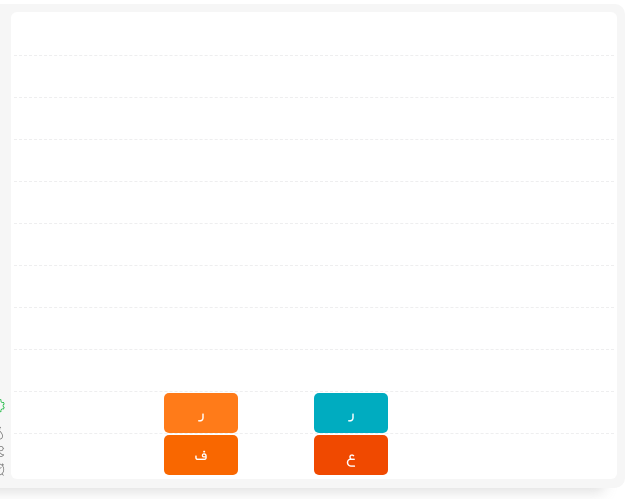

# تنظیمات

با کلیک روی  برات یک پنجره به شکل زیر باز میشه که دارای بخش های مختلفیه. بعد از عکس برات توضیح دادیم هر قسمتو

-   

#### موسیقی پس زمینه

موسیقی که موقع بازی کردن داره پخش میشه رو میتونی کنترل کنی

_پیشفرض: فعال_

#### صداهای رخدادها

صدای پایین اومدن کلمات، حذف شدن کلمات جور شده و ... با این کنترل میشه

_پیشفرض: فعال_

#### انیمیشن

انیمیشن پایین آمدن کلمات، حذف کلمات جور شده و...

_پیشفرض: فعال_

#### نمایش جدا کننده

وقتی فعال باشه یک سری خطوط جدا کننده در محیط اصلی بازی نشون میده که میتونه کمکت کنه تا راحت تر کلمات رو تراز کنی

_پیشفرض: غیر فعال_

-   

#### سطح بازی

جرئت داری سخت ترش کن !!!

_پیشفرض: ساده گذاشتیم عادت کنی_
