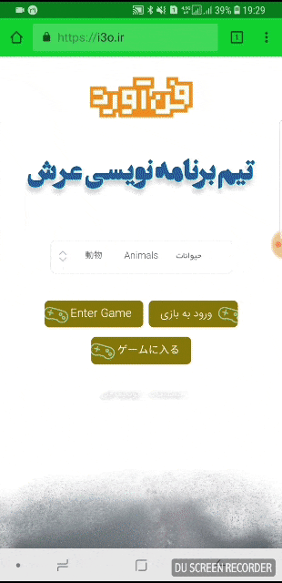

# معرفی

بازی برای اجرا در پلتفرم های مختلف بهینه سازی شده است و سعی بر این شده است تا کمترین افت کیفیت و کارایی را در همه دستگاه های قابل استفاده داشته باشد. در همین راستا برای استفاده ی آفلاین از سیستم از رویکرد PWA استفاده کرده و با استفاده از یک serviceWorker برنامه را در دیوایس کاربر نصب میکنیم . با این کار برنامه در دسک تاپ کاربر قرار میگیرد و برای استفاده های بعدی برای هر زبان نیازی نیست تا دستگاه کاربر به اینترنت متصل باشد و با باز کردن برنامه میتواند از امکانات کامل سیستم استفاده نماید .

نمونه این کاربرد در دیوایس اندرویدی :

;
