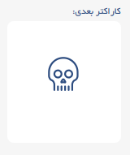

### ۱) کاراکتر اسکلت

این کاراکتر نمیذاره کلمات رو جور کنی و یه جورایی فضارو الکی اشغال میکنه

کاراکتر اسکلت با شکل زیر قبل اومدنش هشدار میده:

و هنگامی که داره میاد به شکل زیر هستش ک کنارش یک عددی نوشته

اگر به تعداد عدد نوشته شده روش کلیک کنی که خب نجات پیدا میکنی وگرنه همینجور میاد پایین تا وقتی که رسید به انتها، تبدیل میشه به شکل زیر:

**توجه:** اگر اسکلت به پایین برسه و کاملا سیاه بشه اونقوت نمیتونی بین کلمات ازش استفاده کنی و انگار یک خونه رو میسوزونه. تنها راهیی که میتونی از بین ببریش اینه که با بمب بزنیش وگرنه همونجا میمونه و یک بلاک رو اشغال میکنه
