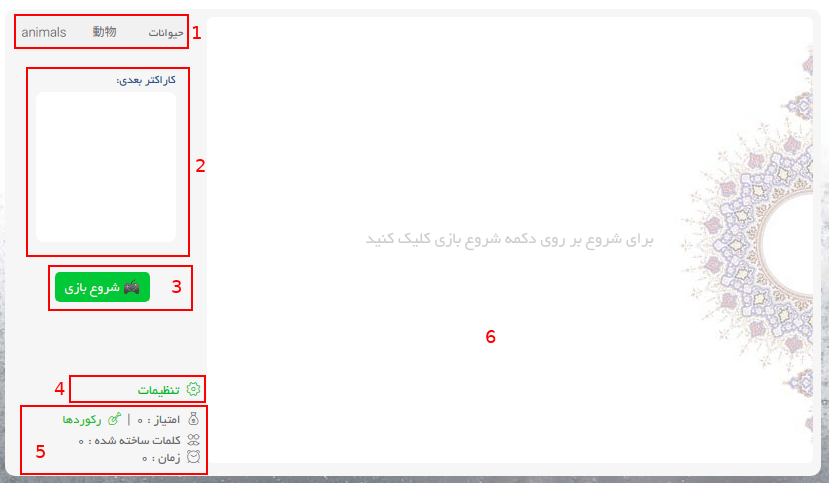

# معرفی محیط بازی

همانطور که در تصویر مشاهده می کنید محیط بازی به ۶ قسمت تقسیم شده است:

1.  ۱- موضوع کلمات انتخاب شده را نشونت می ده
2.  ۲- کاراکتر بعدی که میاد رو نشون میده. میتونه کمک کننده باشه که چجوری کلمات رو بچینی
3.  ۳- در ابتدا که وارد اینجا میشی بازی هنوز شروع نشدست. رو این دکمه کلیک کن تا بازی شروع بشه
4.  ۴- بخش تنظیمات بازیه
5.  ۵- وضعیت امتیاز، تعداد کلمات ساخته شده و مدت زمان طی شده رو بهت نشون میده
6.  ۶- محیط اصلی بازی که در اون حروف میان و باید مرتبشون کنی

