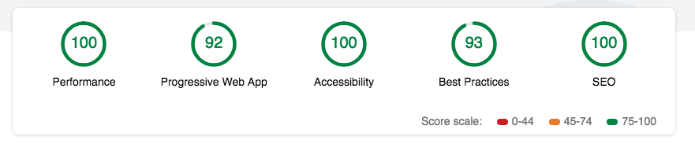
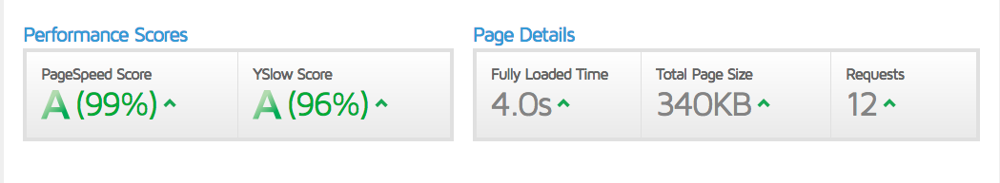

### ۱- نتایج تست سرعت و پرفورمنس

-   سرویس Lightouse : این سرویس برای گوگل کروم می باشد که به عنوان یک extention قابل نصب بر روی مرورگر کروم می باشد . پس از نصب با اضافه شدن آیکون آبی رنگ بالا سمت راست آدرس بار میتوان از امکانات آن برای تست سایت ها استفاده کرد که هم اکنون ورژن ۳.۰.۳ آن در دسترس است ، و برای تست PWA بودن برنامه و performance استفاده میشود. تست زیر نتایج آزمون lightouse بر روی سیستم فعلی می باشد :

سرویس GTmetrix : یک سیستم آنلاین برای بررسی سرعت بارگذاری سایت بر اساس مولفه های خود سایت در قالب siteSpeed و مولفه های سرویس YSlow در قالب ySlowScore می باشد که آماری دقیق از سرعت بارگذاری سایت را ارائه می دهد ، سیستم فعلی پس از اجرا بر روی دامنه و سرور شخصی به صورت زیر نتیجه بدست آمد :

