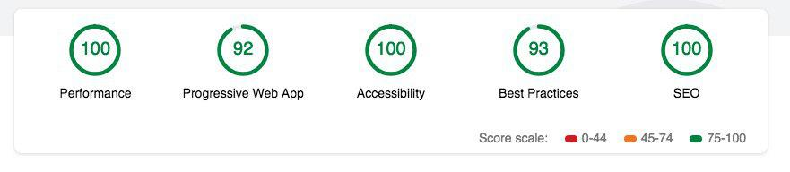

# بازی Tetris فارسی

در این بازی با استفاده از Es6 , CSS۳ , Javascript OOP سعی شده است بهترین Performance، کمترین سایز bundle نهایی واستفاده از انیمیشن های زیبا را داشته باشیم و در عین سادگی و خوانایی کد ، برای توسعه پذیری در آینده نیز شرایط مساعدی داشته باشد. از دیزاین پترن ها و حالت های شی گرایی جاوا اسکریپت به شکل بهینه و اصولی استفاده کرده ایم تا با تولید کامپوننت های قابل استفاده مجدد برای بخش های مختلف بازی بتوانیم با کمترین تکرار کد سرعت اجرای بالایی ارائه دهیم و به دلیل استاندارد نوشتن کد، امکاناتی مانند:

-   ساخت خودکار سند API
-   امکان نوشتن UnitTest راحت
-   توسعه پذیری بالا
-   پیچیدگی کم و کار با اشیا کوچک و کاربردی ... را داشته باشیم.

این توضیح اجمالی شرح مختصری بود برای بخش هایی که هریک را در ادامه و در قسمت مربوطه شرح خواهیم داد.

همان طور که مشاهده می کنید پرفورمنس برنامه در سطح بالایی می باشد 
